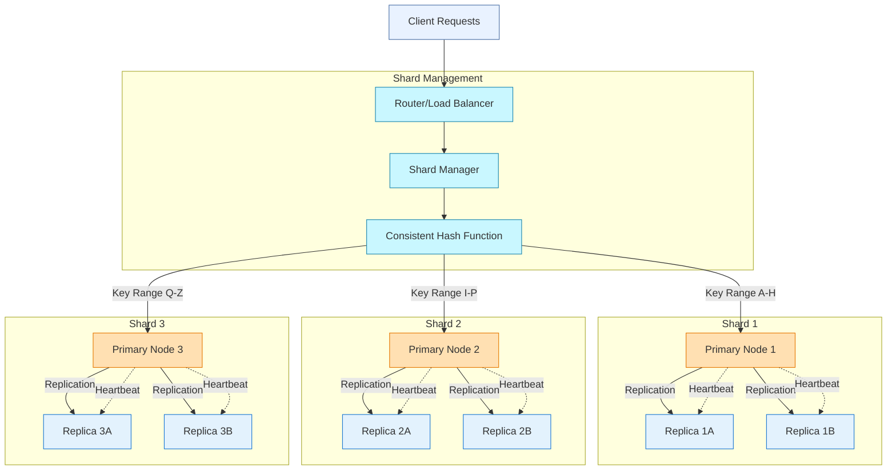

## Architecture


## Performance Metrics
```js
import React from 'react';
import { LineChart, Line, XAxis, YAxis, CartesianGrid, Tooltip, Legend, ResponsiveContainer } from 'recharts';

const data = [
  {
    name: '1 Node',
    reads: 15000,
    writes: 8000,
    replication: 6500,
  },
  {
    name: '3 Nodes',
    reads: 42000,
    writes: 23000,
    replication: 19000,
  },
  {
    name: '5 Nodes',
    reads: 68000,
    writes: 34000,
    replication: 28000,
  },
  {
    name: '10 Nodes',
    reads: 120000,
    writes: 65000,
    replication: 48000,
  },
];

export default function PerformanceChart() {
  return (
    <div className="bg-white p-4 rounded-lg shadow">
      <h2 className="text-xl font-bold text-center mb-4">Key-Value Store Performance</h2>
      <div className="h-64">
        <ResponsiveContainer width="100%" height="100%">
          <LineChart
            data={data}
            margin={{
              top: 5,
              right: 30,
              left: 20,
              bottom: 5,
            }}
          >
            <CartesianGrid strokeDasharray="3 3" />
            <XAxis dataKey="name" />
            <YAxis />
            <Tooltip />
            <Legend />
            <Line type="monotone" dataKey="reads" stroke="#3498db" activeDot={{ r: 8 }} />
            <Line type="monotone" dataKey="writes" stroke="#2ecc71" />
            <Line type="monotone" dataKey="replication" stroke="#e74c3c" />
          </LineChart>
        </ResponsiveContainer>
      </div>
      <div className="mt-4 text-sm text-gray-600">
        <p className="text-center">Performance metrics measured on AWS c5.2xlarge instances, 5000 concurrent clients</p>
      </div>
    </div>
  );
}
```
# MIT 6.824 Distributed Systems Labs

### (Updated to Spring 2020 Course Labs)

Course website: http://nil.csail.mit.edu/6.824/2020/schedule.html

- [x] Lab 1: MapReduce

- [x] Lab 2: Raft Consensus Algorithm
  - [x] Lab 2A: Raft Leader Election
  - [x] Lab 2B: Raft Log Entries Append
  - [x] Lab 2C: Raft state persistence
  
- [x] Lab 3: Fault-tolerant Key/Value Service
  - [x] Lab 3A: Key/value Service Without Log Compaction
  - [x] Lab 3B: Key/value Service With Log Compaction

- [x] Lab 4: Sharded Key/Value Service
