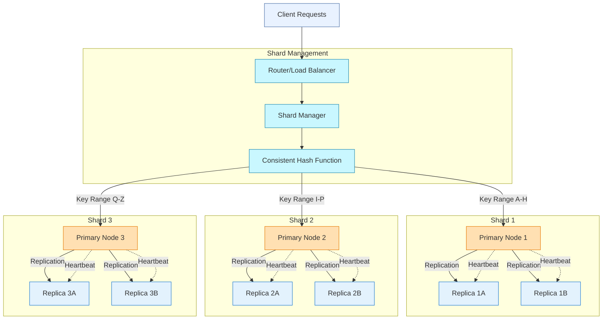
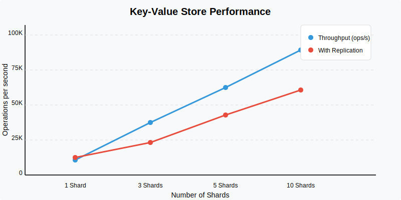

A high-performance, horizontally scalable key-value store written in Go that implements sharding for data distribution and replication for fault tolerance.

## Overview
This distributed key-value store is designed for high throughput and availability. It uses consistent hashing to distribute data across multiple shards, with each shard maintaining replicas to ensure data durability and availability even in the presence of node failures.

## Architecture

The system consists of the following components:

- Client Interface: Provides a simple API for put/get operations
- Router/Load Balancer: Routes requests to the appropriate shard based on the key
- Shard Manager: Manages shard assignments and handles node additions/removals
- Primary Nodes: Each responsible for a specific key range
- Replica Nodes: Maintain copies of data from primary nodes for fault tolerance

Data writes are first directed to the primary node for a key, then asynchronously replicated to replica nodes. Reads can be served by either primary or replica nodes, depending on configuration (consistency vs. availability tradeoff).

## Key Features

- Horizontal Scalability: Add more nodes to increase capacity and throughput
- Automatic Sharding: Data automatically distributed across available nodes
- Configurable Replication: Set replication factor based on reliability needs
- Fault Tolerance: System remains operational despite node failures
- Consistent Hashing: Minimizes data redistribution when scaling
- Tunable Consistency: Configure for strong or eventual consistency
- Simple API: Straightforward interface for basic operations

## Performance Metrics

## Roadmap

- [x] Raft Consensus Algorithm
  - [x] Raft Leader Election
  - [x] Raft Log Entries Append
  - [x] Raft state persistence
  
- [x] Fault-tolerant Key/Value Service
  - [x] Key/value Service Without Log Compaction
  - [x] Key/value Service With Log Compaction

- [x] Sharded Key/Value Service
