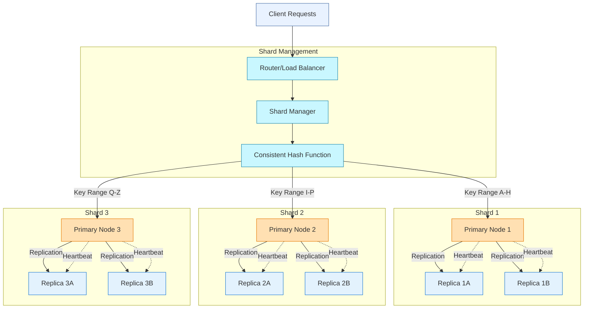

## Architecture

## Performance Metrics

# MIT 6.824 Distributed Systems Labs

### (Updated to Spring 2020 Course Labs)

Course website: http://nil.csail.mit.edu/6.824/2020/schedule.html

- [x] Lab 1: MapReduce

- [x] Lab 2: Raft Consensus Algorithm
  - [x] Lab 2A: Raft Leader Election
  - [x] Lab 2B: Raft Log Entries Append
  - [x] Lab 2C: Raft state persistence
  
- [x] Lab 3: Fault-tolerant Key/Value Service
  - [x] Lab 3A: Key/value Service Without Log Compaction
  - [x] Lab 3B: Key/value Service With Log Compaction

- [x] Lab 4: Sharded Key/Value Service
